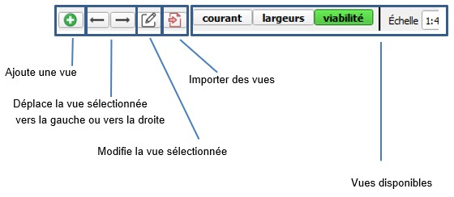
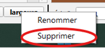
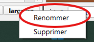
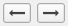
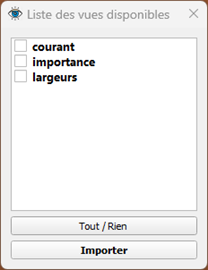

<table>
<colgroup>
<col style="width: 21%" />
<col style="width: 78%" />
</colgroup>
<tbody>
<tr>
<td rowspan="2"></td>
<td style="font-size: 24px;text-align: center;">
<strong>Plugin MultiViewManager</strong>

</td>
</tr>
<tr>
<td style="font-size: 16px;text-align: center;">Développeur  : Gérôme PECHEUR (IGN)</td>
</tr>
</tbody>
</table>

- [1. Prérequis](#prerequis)
- [2. Résumé](#resume)
- [3. Présentation](#presentation)
    - [3.1 Ajouter une vue](#ajouter-une-vue)
    - [3.2 Supprimer une vue](#supprimer-une-vue)
    - [3.3 Renommer une vue](#renommer-une-vue)
    - [3.4 Déplacer un onglet vue](#deplacer-un-onglet-vue)
    - [3.5 Modifier une vue](#modifier-une-vue)
    - [3.6 Importer une vue](#importer-une-vue)  

  

  <h2 id="prerequis" style="color: white;margin:0;" >1. Prérequis</h2>

  

Version de QGIS 3 : 3.28 ou supérieure.    

  <h2 id="resume" style="color: white;margin:0;">2. Résumé</h2>

  

Le plugin MultiViewManager permet de sauvegarder le style et les visibilités des couches du projet actif dans la barre d’état de QGis sous forme d’onglets.  
Il permet aussi de supprimer ces vues, de les modifier et de les organiser.  

  

  <h2 id="presentation" style="color: white;margin:0;">3. Présentation</h2>

  

Ce Plugin se lance dés le chargement d'un projet.
Il se place dans la barre d'état

 
	

  
  

  <h2 id="ajouter-une-vue" style="color: white;margin:0;" >3.1 Ajouter une vue</h2>

-	Modifier les styles des couches du projet selon le rendu désiré.    
-	Cliquer sur le bouton   
-	Entrer le nom de la vue.  
  

  <h2 id="supprimer-une-vue" style="color: white;margin:0;" >3.2 Supprimer une vue</h2>

-	Clic droit sur l’onglet vue à supprimer  
-	  

  <h2 id="renommer-une-vue" style="color: white;margin:0;" >3.3 Renommer une vue</h2>

- Clic droit sur l’onglet vue à renommer  
-   
- Saisir le nouveau nom et confirmer avec le bouton OK  
  

  <h2 id="deplacer-un-onglet-vue" style="color: white;margin:0;" >3.4 Déplacer un onglet vue</h2>

- Sélectionner l’onglet de la vue à déplacer. Il apparaît en vert.  
- Cliquer sur les flèches  pour déplacer l’onglet vers la gauche ou vers la droite.  

  

  <h2 id="modifier-une-vue" style="color: white;margin:0;" >3.5 Modifier une vue</h2>

- Sélectionner l’onglet de la vue à modifier. Il apparaît en vert.  
- Modifier les styles et/ou visibilités des couches dans le panneau Couches.  
- Cliquer sur le bouton  et confirmer.  
  

  <h2 id="importer-une-vue" style="color: white;margin:0;" >3.6 Importer une vue</h2>

La création de vues avec ce plugin crée un répertoire VUES à la racine du projet.  
Le bouton  permet d’importer une vue déjà créée dans un autre projet  

- Naviguer et sélectionner le répertoire VUES à partir duquel importer une vue  
- Cocher la ou les vues disponibles à importer  

 
	

- Cliquer sur le bouton "Importer" pour ajouter la vue dans le projet.  
Si une vue du même nom existe déjà, l’outil fait une mise à jour de celle-ci
